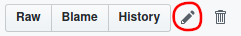
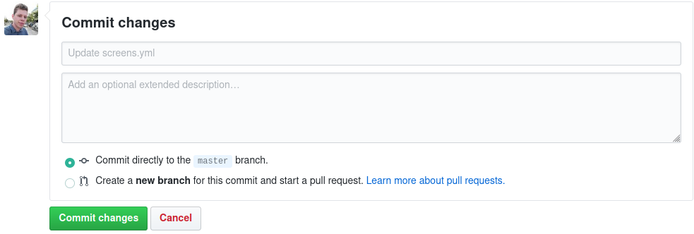

# Time to Move online quiz

This is the source code for a online quiz done during the [Time to Move](https://timetomove.eurodesk.eu/) campaign.

- [Time to Move online quiz](#time-to-move-online-quiz)
  - [How it works](#how-it-works)
    - [Elements](#elements)
      - [Options](#options)
      - [Screen](#screen)
      - [Question](#question)
      - [End](#end)
  - [Modifying the quiz](#modifying-the-quiz)
  - [License](#license)

---

## How it works
This is a [svelte](https://svelte.dev/) app for an online quiz.
In the file [`public/screens.yml`](public/screens.yml) the structure of the quiz is specified in the [YAML](https://yaml.org/spec/1.2/spec.html) markup language.
The app gets build automatically when files change and is published at https://hubben-amal.github.io/timetomove-quiz/

### Elements
#### Options
```yml
options:
  score: 10
```

Here you specify the number of questions in the quiz.
#### Screen
```yml
identifier: 
  type: screen
  text: |-
    The content shown in the screen
  next: <identifier of next element>
  next_text: Text to display on the button
```

Every screen starts with an **identifier** which has to be unique. 
This allows us to set up how the user will move through the quiz.
The `screen` element has these properties:
*  `type`: type of the element (`screen`)
*  `text`: the content to show in the screen, you can use the [Markdown](https://github.com/adam-p/markdown-here/wiki/Markdown-Cheatsheet) markup language
*  `next`: the **identifier** of the next element. At the bottom of the screen there will be a button which will navigate to this element
*  `next_text`: the text in the button

#### Question

```yml
identifier: 
  type: question
  question: >-
    The question shown
  next: <identifier of next element>
  options: 
    - text: Option 1
      result: true
    - text: Option 2
      result: false
    ...
```
Every question starts with an **identifier** which has to be unique. 
This allows us to set up how the user will move through the quiz.
The `question` element has these properties:
*  `type`: type of the element (`question`)
*  `question`: the content to show in the question (i.e. the question itself), you can use the [Markdown](https://github.com/adam-p/markdown-here/wiki/Markdown-Cheatsheet) markup language
*  `next`: the **identifier** of the next element. At the bottom of the screen there will be a button which will navigate to this element
*  `options`: An array with the multiple choice options for the question
   *  `text`: Write the option here
   *  `result`: Set to `true` or `false` depending on whether the option is correct.
#### End
```yml 
identifier: 
  type: end
  text: |-
    The content shown in the end screen
  submit: <link to submit>
  submit_text: Text on the submit button
``` 

The end screen starts with an **identifier** which has to be unique. 
This allows us to set up how the user will move through the quiz.
The `end` element has these properties:
*  `type`: type of the element (`end`)
*  `text`: the content to show in the end screen, you can use the [Markdown](https://github.com/adam-p/markdown-here/wiki/Markdown-Cheatsheet) markup language
*  `submit`: A link to a form to submit details to be able to pick winners for prizes.
*  `submit_text`: the text in the button

## Modifying the quiz
Navigate to [`public/screens.yml`](public/screens.yml) and click the edit icon.



Make the changes in the file, afterwards navigate to the bottom of the screen and commit the changes.



The new version will automatically be put online in a few seconds (or minutes).

## License

MIT © 2019 Theo Dedeken
